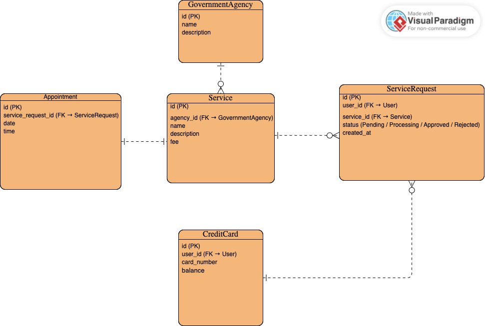

# Yusr - Backend

## Project Description
The Yusr backend is built using Django REST Framework (DRF) and provides all API endpoints for the Yusr application.  
It manages users, government agencies, services, service requests, appointments, traffic fines, and credit card data.  
All routes are protected using JWT authentication.

---

## ERD Diagram
Add your ERD image below:




---

## RESTful Routing Table

| Endpoint | Method | Description |
|-----------|---------|-------------|
| /agencies/ | GET | List all government agencies |
| /services/ | GET | List all services |
| /services/<id>/ | GET | Retrieve specific service |
| /service-requests/ | GET, POST | List or create service requests |
| /service-requests/<id>/ | GET, PUT, DELETE | Retrieve, update, or delete a request |
| /service-requests/<id>/pay/ | POST | Pay for a service request |
| /appointments/ | GET, POST | Manage appointments |
| /traffic-fines/ | GET | List traffic fines |
| /credit-card/ | GET | View user’s credit card info |
| /users/signup/ | POST | Create new user |
| /users/login/ | POST | Login and get JWT token |

---

## Models Overview

| Model | Description |
|--------|-------------|
| GovernmentAgency | Represents a government entity (e.g., Ministry of Health) |
| Service | Services provided by each agency |
| ServiceRequest | User-submitted service applications |
| Appointment | Scheduled appointments for services |
| TrafficFine | User’s traffic fines |
| CreditCard | User’s payment method |
| User | Default Django user model |

---

## Technologies Used

| Category | Tools |
|-----------|--------|
| Framework | Django REST Framework |
| Database | PostgreSQL |
| Authentication | JWT (djangorestframework-simplejwt) |
| Environment Management | python-dotenv |
| API Testing | Django TestCase |
| CORS Handling | django-cors-headers |
| Containerization | Docker & Docker Compose |
| Version Control | Git & GitHub |

---

## Installation Instructions

1. Clone the repository:
   ```bash
   git clone <backend-repo-link>
   cd backend

Create and activate a virtual environment:
pipenv shell
Install dependencies:
pipenv install
Run migrations:
python3 manage.py migrate
Create a superuser:
python3 manage.py createsuperuser
Run the server:
python3 manage.py runserver
Access the API:
http://127.0.0.1:8000/
---


Icebox Features
Add admin dashboard for managing services and users
Integrate AI chatbot response logic directly with backend
Add email/SMS notifications for service updates
Add logging and analytics for service usage
Challenges / Key Takeaways
Managing multiple related models and foreign keys
Implementing JWT authentication and securing endpoints
Ensuring clean RESTful API design and proper status codes
Testing CRUD operations using Django TestCase

---


Links
Frontend Repository: [https://github.com/lujainabdulmohsen/frontend-capstone]
